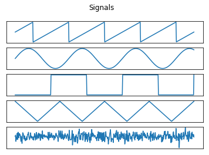
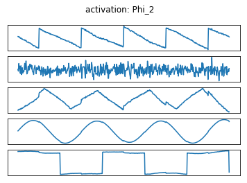
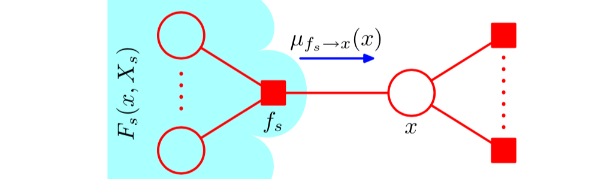
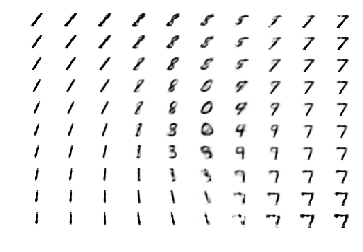

# Machine Learning 2


[](LICENSE)


## Description
Homeworks and code for the labs of the [Machine Learning 2 (2018/2019)](http://coursecatalogue.uva.nl/xmlpages/page/2018-2019-en/search-course/course/66065) courses of the MSc in Artificial Intelligence at the University of Amsterdam.


Contributors: 
The labs where done in collaboration with [Sindy Löwe](https://github.com/loeweX). 

## Homeworks
- Probability Distributions and Exponential Family
- Information Theory and Bayesian Networks
- Exponential Families, ICA, Graphical Models and D-Separation
- Bayesian Networks, Factor Graphs and Message Passing Algorithm
- Expectation Maximization
- Sampling Methods and Variational Expectation Maximization
- Linear Dynamical Systems and Causality

## Labs
#### Independent Component Analysis

Original Signals             |  Reconstructed Signals
:-------------------------:|:-------------------------:
|

#### Inference in Graphical Models



<p align="center">
 <i>Factor Graph of Interest 
 [Pattern Recognition and Machine Learning, Bishop]
</i>
 </p>


#### Expectation Maximization and Variational Autoencoder



<p align="center">
  <i> Manifold Learned by VAE on MNIST</i>
</p>

## Dependencies
With anacodna use ```environment.yml``` provided in the lab directory which contains:

- jupyter=1.0.0
- matplotlib=2.2.2
- numpy=1.14.2
- python=3.6.4
- scipy=1.0.0


### Run the labs
Make sure all the dependencies are present and execute as:
``` 
jupyter notebook NOTEBOOK_NAME.ipynb
```

### Note


Please follow the <a href="http://student.uva.nl/en/content/az/plagiarism-and-fraud/plagiarism-and-fraud.html">UvA regulations governing Fraud and Plagiarism</a> in case you are a student.
